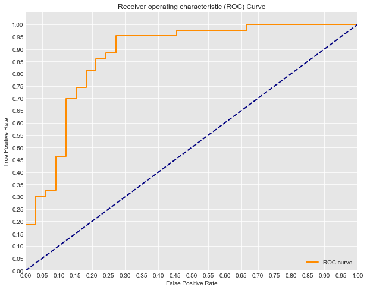

# AUC and ROC

Some of our accuracy scores thus far probably seem pretty impressive; an 80% accuracy seems pretty darn good on first try! What we have to keep in mind is that when predicting a binary classification, we are bound to be right sometimes, even just by guessing. For example, I should be roughly 50% accurate in guessing whether or not a coin lands on heads. This also can lead to issues tuning models down the road. If you have a skewed datasets with rare events (such as a disease or winning the lottery) where there is only 2 positive cases in 1000, then even a trivial algorithm that classifies everything as 'not a member' will achieve an accuracy of 99.8% (998 out of 1000 times it was correct). So remember that an 80% accuracy must be taken into a larger context.


With that, another way to analyze classification errors is with AUC, which stands for 'area under curve'. 

What curve you ask? The Receiver Operater Curve (ROC Curve) which illustrates the false positive against false negative rate of our classifier. When training a classifier, we are hoping the ROC curve will hug the upper left corner of our graph. A classifier with 50-50 accuracy is deemed 'worthless'; this is no better then random guessing, as in the case of a coin flip.


The ROC curve gives us a graph of the tradeoff between this false positive and true positive rate. The AUC, or area under the curve, gives us a singular metric to compare these. An AUC of 1 being a perfect classifier, and an AUC of .5 being that which has a precision of 50%.

Another perspective to help understand the ROC curve is to think about the underlying model fueling our classification algorithm. Remember that the logistic model produces probabilities that each observation is of a specific class. Imagine that the values produced from the logistic model look something like this:


Here we see the majority of the two classes probabilities land at around .25 or .75. If we alter the cutoff point, we can sacrifice precision, increasing the false positive rate in order to also increase the true positive rate, or vice versa. Imagine here green is the positive case 1 (in this case heart disease) and red the negative case 0. Shifting the decision boundary to the left from 0.5 will result in capturing more of the positive (1) cases. At the same time, we will also pick up some false negatives, those red cases at the far right of the negative (0) case distribution.


Models with poor ROC might have large overlaps in the probability estimates for the two classes. This would indicate that the algorithm performed poorly and had difficulty seperating the two classes from each other.


With that, let's take a look at drawing the ROC curve in practice.

# As before lets train an Classifier to Start


```python
from sklearn.linear_model import LogisticRegression
from sklearn.model_selection import train_test_split
import pandas as pd


#Load the data
df = pd.read_csv('heart.csv')

#Define appropriate X and y
X = df[df.columns[:-1]]
y = df.target

#Normalize the Data
for col in df.columns:
    df[col] = (df[col]-min(df[col]))/ (max(df[col]) - min(df[col]))

# Split the data into train and test sets.
X_train, X_test, y_train, y_test = train_test_split(X, y, random_state=0)

#Fit a model
logreg = LogisticRegression(fit_intercept = False, C = 1e12) #Starter code
model_log = logreg.fit(X_train, y_train)
print(model_log) #Preview model params

#Predict
y_hat_test = logreg.predict(X_test)

#Data Preview
df.head()
```

    LogisticRegression(C=1000000000000.0, class_weight=None, dual=False,
              fit_intercept=False, intercept_scaling=1, max_iter=100,
              multi_class='ovr', n_jobs=1, penalty='l2', random_state=None,
              solver='liblinear', tol=0.0001, verbose=0, warm_start=False)


<div>
<style scoped>
    .dataframe tbody tr th:only-of-type {
        vertical-align: middle;
    }

    .dataframe tbody tr th {
        vertical-align: top;
    }

    .dataframe thead th {
        text-align: right;
    }
</style>
<table border="1" class="dataframe">
  <thead>
    <tr style="text-align: right;">
      <th></th>
      <th>age</th>
      <th>sex</th>
      <th>cp</th>
      <th>trestbps</th>
      <th>chol</th>
      <th>fbs</th>
      <th>restecg</th>
      <th>thalach</th>
      <th>exang</th>
      <th>oldpeak</th>
      <th>slope</th>
      <th>ca</th>
      <th>thal</th>
      <th>target</th>
    </tr>
  </thead>
  <tbody>
    <tr>
      <th>0</th>
      <td>0.708333</td>
      <td>1.0</td>
      <td>1.000000</td>
      <td>0.481132</td>
      <td>0.244292</td>
      <td>1.0</td>
      <td>0.0</td>
      <td>0.603053</td>
      <td>0.0</td>
      <td>0.370968</td>
      <td>0.0</td>
      <td>0.0</td>
      <td>0.333333</td>
      <td>1.0</td>
    </tr>
    <tr>
      <th>1</th>
      <td>0.166667</td>
      <td>1.0</td>
      <td>0.666667</td>
      <td>0.339623</td>
      <td>0.283105</td>
      <td>0.0</td>
      <td>0.5</td>
      <td>0.885496</td>
      <td>0.0</td>
      <td>0.564516</td>
      <td>0.0</td>
      <td>0.0</td>
      <td>0.666667</td>
      <td>1.0</td>
    </tr>
    <tr>
      <th>2</th>
      <td>0.250000</td>
      <td>0.0</td>
      <td>0.333333</td>
      <td>0.339623</td>
      <td>0.178082</td>
      <td>0.0</td>
      <td>0.0</td>
      <td>0.770992</td>
      <td>0.0</td>
      <td>0.225806</td>
      <td>1.0</td>
      <td>0.0</td>
      <td>0.666667</td>
      <td>1.0</td>
    </tr>
    <tr>
      <th>3</th>
      <td>0.562500</td>
      <td>1.0</td>
      <td>0.333333</td>
      <td>0.245283</td>
      <td>0.251142</td>
      <td>0.0</td>
      <td>0.5</td>
      <td>0.816794</td>
      <td>0.0</td>
      <td>0.129032</td>
      <td>1.0</td>
      <td>0.0</td>
      <td>0.666667</td>
      <td>1.0</td>
    </tr>
    <tr>
      <th>4</th>
      <td>0.583333</td>
      <td>0.0</td>
      <td>0.000000</td>
      <td>0.245283</td>
      <td>0.520548</td>
      <td>0.0</td>
      <td>0.5</td>
      <td>0.702290</td>
      <td>1.0</td>
      <td>0.096774</td>
      <td>1.0</td>
      <td>0.0</td>
      <td>0.666667</td>
      <td>1.0</td>
    </tr>
  </tbody>
</table>
</div>


## Drawing the ROC Curve
  
In practice, a good way to implement AUC and ROC is via sklearn's  built in methods:


```python
from sklearn.metrics import roc_curve, auc
```


```python
#scikit learns built in roc_curve method returns the fpr, tpr and thresholds
#for various decision boundaries given the case member probabilites
y_score = logreg.fit(X_train, y_train).decision_function(X_test)

fpr, tpr, thresholds = roc_curve(y_test, y_score)
```

From there we can easily calculate the AUC:


```python
print('AUC: {}'.format(auc(fpr, tpr)))
```

    AUC: 0.8738548273431994


### Putting it all together as a cohesive visual:


```python
import matplotlib.pyplot as plt
import seaborn as sns
%matplotlib inline

#Seaborns Beautiful Styling
sns.set_style("darkgrid", {"axes.facecolor": ".9"})

print('AUC: {}'.format(auc(fpr, tpr)))
plt.figure(figsize=(10,8))
lw = 2
plt.plot(fpr, tpr, color='darkorange',
         lw=lw, label='ROC curve')
plt.plot([0, 1], [0, 1], color='navy', lw=lw, linestyle='--')
plt.xlim([0.0, 1.0])
plt.ylim([0.0, 1.05])
plt.yticks([i/20.0 for i in range(21)])
plt.xticks([i/20.0 for i in range(21)])
plt.xlabel('False Positive Rate')
plt.ylabel('True Positive Rate')
plt.title('Receiver operating characteristic (ROC) Curve')
plt.legend(loc="lower right")
plt.show()
```

    AUC: 0.8738548273431994





## Interpretation
Think about the scenario we've been describing thus far; predicting heart disease. If you tune the current model to have and 80% True Positive Rate, (you've still missed 20% of those with heart disease), what is the False positive rate?


```python
fp = .22#write the approximate fpr when tpr=.8
```

## Interpretation 2
If you instead tune the model to have a 95% True Postive Rate, what will the False Postive Rate be?


```python
fp = .46 #write the approximate fpr when tpr=.95
```

## Opinion
In the case of heart disease that we've been talking about, do you find any of the above cases acceptable? How would you tune the model. Describe what this would mean in terms of the number of patients falsely scared of having heart disease and the risk of missing the warning signs for those who do actually have heart disease.

#### Answers will vary, important observations noted below. 
Overall, the algorithm isn't fully acceptable performance for such a signifcant test. We would hope for a high recall such as in interpretation 2 (even then we miss 5% of positive cases) but to do so would give us a false positive rate of over 40% which is also completely unacceptable (can you imagine telling 40% of those who don't have a disease that they do?). 
